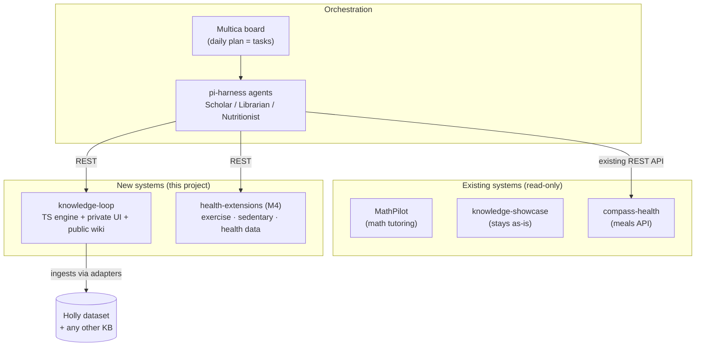

# Knowledge Loop — Master Blueprint

> Founding document, 2026-06-12. Working name: **knowledge-loop** (rename freely).
> This is the integration blueprint for Holly's complete personal system AND the design
> doc for the new knowledge-processing engine that anchors it.
>
> **How to read this document:** every section ends with a **✅ Completion criteria**
> block — concrete, checkable conditions (a command to run, a behavior to observe, a
> test that must pass). A section counts as done only when every box can be ticked.
> Milestone reviews (§5) walk these checklists.

---

## 0. Ground rules

1. **Existing projects are frozen.** MathPilot (`C:\Users\Holly\Documents\数学项目`),
   knowledge-showcase (`G:\knowledge-showcase`), compass-health (`C:\Users\Holly\compass-health`),
   Multica (`G:\multica-ai-multica-https-github-com`), and pi-harness (`G:\pi-harness`)
   are never modified. We reuse their *designs and patterns* and talk to them only
   through their existing external interfaces (HTTP APIs, CLIs, data exports).
2. **Multica is the hub.** The daily plan lives on the Multica board. Agents (built with
   pi-harness) execute board tasks by calling domain-system APIs.
3. **knowledge-loop is generic.** It ingests *any* knowledge base through pluggable
   source adapters. The Holly dataset (`G:\dataset\Holly dataset`) is the first adapter
   instance, not a hard-coded dependency.
4. **Patterns carried over from the existing projects** (proven there, kept here):
   - Mock mode is a first-class path — the full loop runs with no API key (MathPilot).
   - Deterministic engine wherever possible; LLM only for soft tasks like concept
     extraction, page writing, rubric grading (compass-health).
   - Every agent/pipeline step emits trace events for debugging (MathPilot's Agent Trace).
   - User-facing layers are bilingual zh/en (compass-health, Multica).
   - LLM output that reaches the learner is grounded in cited source chunks.

**✅ Completion criteria (checked at every milestone review)**
- [ ] `git status` in each of the five frozen repos shows no modifications attributable
      to this project (untouched working trees; only their own pre-existing changes).
- [ ] No file under this project imports from or writes into a frozen repo's directory;
      `grep` for the five frozen paths in `G:\knowledge-loop` source yields only docs/config
      references to *external* interfaces (URLs, CLI invocations), never file writes.
- [ ] With **no API key set**, every user-facing flow in this blueprint still completes
      end-to-end in mock mode (criterion re-verified per section below).
- [ ] Every pipeline step writes at least one trace event (verified by §2.4 criteria).

---

## 1. System map



**✅ Completion criteria**
- [ ] Every arrow in this diagram corresponds to a working integration demonstrated in a
      milestone review (M1: KL→DS; M2: MU→PH, PH→KL, PH→CH; M4: PH→HX).
- [ ] No integration exists that is *not* in this diagram (architecture drift check —
      update the diagram first if a new connection is needed).

---

## 2. knowledge-loop — the new knowledge-processing system

### 2.1 Stack

- **TypeScript end-to-end.** Next.js (App Router) single app:
  - `src/engine/` — pure-TS core (no Next imports) so the CLI, API routes, and
    pi-harness agents can all consume it.
  - `src/app/(learn)/` — private learning UI (today's plan, wiki reader, quiz, teach-back).
  - `src/app/(public)/wiki/` — public site; only pages flagged `public` are served.
  - `src/app/api/` — REST surface for agents/Multica.
  - `src/cli/` — `kl ingest`, `kl plan`, `kl quiz` for headless use.
- **SQLite** via Drizzle ORM (`knowledge-loop.db`).
- **LLM client:** OpenAI-compatible SDK pointed at DeepSeek / Qwen base URLs
  (same env-var convention as MathPilot: `DEEPSEEK_API_KEY`, `QWEN_API_KEY`,
  `LLM_PROVIDER`); no key ⇒ mock mode.

**✅ Completion criteria**
- [ ] `npm run check` (typecheck + lint + unit tests) passes from a clean clone.
- [ ] `npm run dev` starts the app; private UI and public wiki both render.
- [ ] `src/engine/` has zero imports from `next` or `src/app` (enforced by a lint rule
      or a dependency-check test, not just convention).
- [ ] Each CLI command (`kl ingest`, `kl plan`, `kl quiz`) runs headless against the
      same database the web app uses and exits 0 on the happy path.
- [ ] Deleting all `*_API_KEY` env vars and rerunning the full test suite still passes
      (mock mode is exercised by CI, not just available).
- [ ] Switching `LLM_PROVIDER` between `deepseek` / `qwen` / unset requires env-var
      changes only — no code edits.

### 2.2 Source adapters (the "generic" requirement)

```ts
interface SourceAdapter {
  id: string;                          // "holly-vault"
  kind: string;                        // "markdown-vault" | "pdf-folder" | "url-list" | "git-repo"
  listDocuments(): AsyncIterable<DocRef>;
  readDocument(ref: DocRef): Promise<RawDoc>;   // text + media refs + metadata
  fingerprint(ref: DocRef): string;             // change detection for incremental re-ingest
}
```

- **M1 adapter:** `MarkdownVaultAdapter` — reads an Obsidian-style vault
  (wikilinks, frontmatter, attachments). Configured instance: Holly dataset.
  Include/exclude globs so private folders (e.g. `90_待确认`, interview notes) can be
  skipped per-adapter.
- Later adapters: PDF folder, URL list, git repo. Adding a KB = adding a config entry,
  never code in the core.

**✅ Completion criteria**
- [ ] A shared **adapter conformance test suite** exists; any adapter must pass it
      (list → read → fingerprint round-trip on a fixture dataset).
- [ ] `MarkdownVaultAdapter` passes conformance tests against a fixture vault containing
      wikilinks, frontmatter, an attachment, and a non-UTF-8-safe filename (Chinese names).
- [ ] Pointing the adapter config at `G:\dataset\Holly dataset` lists its documents;
      excluded globs (e.g. `90_待确认/**`) provably never appear in `sources`.
- [ ] Editing one vault file changes only that document's `fingerprint()` output.
- [ ] **Genericity proof (M5):** a second adapter is added and a second dataset ingested
      with `git diff` showing changes only under `src/adapters/` and config — zero
      diffs in `src/engine/` core.

### 2.3 Data model (adapted from MathPilot V2's schema)

```
sources         adapter_id, doc_ref, title, fingerprint, status, ingested_at
chunks          source_id, seq, text, meta              -- provenance units
concepts        slug, name, summary, domain, status(stub|generated|reviewed)
concept_edges   from, to, kind(prerequisite|related|part_of), weight   -- DAG enforced
pages           concept_id, version, markdown, citations(chunk_ids), visibility(private|public)
items           concept_ids, type(mcq|fill_in|free_form), difficulty, statement, answer_spec
attempts        item_id, response, verdict, grading_method(exact|rubric), created_at
teachbacks      concept_id, transcript, rubric_report(json: score, gaps[]), created_at
mastery         concept_id, score(0-1), confidence, attempts_n, last_seen_at   -- single source of truth
study_plans     date, queue(json: ordered activities), rationale, status
reviews         concept_id, fsrs_state(json), due_at                -- Phase 2
```

**✅ Completion criteria**
- [ ] Drizzle migrations create the full schema on an empty database; migrations are
      replayable (drop DB → migrate → schema matches snapshot test).
- [ ] A unit test inserts a cycle-creating `concept_edges` row via the engine API and
      it is **rejected and logged** (DAG invariant holds).
- [ ] Every `pages.citations` entry resolves to an existing chunk (foreign-key or
      integrity test); a page with zero citations cannot reach `visibility=public`.
- [ ] `mastery` is written by exactly one engine module (grading/diagnosis); a code
      search shows no other writer — planner and UI only read it.
- [ ] Schema changes after M1 ship as new migrations, never by editing applied ones.

### 2.4 Pipelines

**Ingestion** (incremental, fingerprint-driven):
chunk (heading-aware) → extract concept candidates (LLM; mock = heading-based) →
merge/dedupe against existing concepts → propose prerequisite edges (cycle-rejecting) →
generate wiki pages grounded in chunks with citations.

**Daily learning loop:**
1. **Plan** — deterministic planner reads `mastery` + ungenerated/unseen concepts →
   today's queue: N new concepts to learn, M to quiz, K teach-backs (+ reviews in Phase 2).
2. **Learn** — wiki reader with "explain differently / go deeper" regeneration.
3. **Verify** —
   - *Phase 1a:* generated quiz items, graded exact-match or LLM-rubric → mastery update.
   - *Phase 1b:* teach-back — learner explains the concept in their own words; LLM grades
     against the page with a rubric and lists gaps → mastery update.
   - *Phase 2:* FSRS spaced-repetition queue; application tasks graded by execution/rubric.
4. **Diagnose** — weakness report feeds tomorrow's plan.

**✅ Completion criteria**

*Ingestion*
- [ ] Running `kl ingest` twice in a row: the second run is a no-op (0 sources
      reprocessed) — proven by trace output.
- [ ] Editing one source file and re-running ingests **only** that file's chunks and
      re-evaluates only affected concepts.
- [ ] On the Holly dataset: ingest completes without crashing on any file; failures are
      recorded per-source with `status=error` + reason, never aborting the whole run.
- [ ] In mock mode, ingestion still yields concepts (heading-based) and pages.
- [ ] Every generated page's claims carry citations; rendered pages show clickable
      provenance back to the source chunk.

*Daily loop*
- [ ] Given the same `mastery` table and date, `kl plan` is deterministic (same queue,
      verified by a snapshot test).
- [ ] The plan respects prerequisite order: no concept is queued for learning before its
      prerequisites reach a configurable mastery threshold (unit test on a fixture graph).
- [ ] Quiz grading: exact-match path verified by unit tests; LLM-rubric path verified
      with mock grader; a graded attempt visibly changes `mastery.score`.
- [ ] Teach-back: submitting an explanation returns a rubric report with a score **and**
      at least the `gaps[]` structure; the report references the page it graded against;
      mastery updates.
- [ ] Diagnose: after a session with deliberate wrong answers on concept X, the next
      day's plan includes X for re-study (integration test).
- [ ] Every pipeline stage (chunk, extract, merge, link, page-gen, plan, grade, diagnose)
      emits trace events queryable per run (`kl trace <run-id>` or equivalent).

### 2.5 API surface (what agents call)

```
POST /api/ingest/run?adapter=…     trigger incremental ingest
GET  /api/plan/today               today's study plan (creates one if absent)
POST /api/plan/generate            force regeneration
GET  /api/mastery/summary          per-concept mastery + weak spots
POST /api/quiz/grade               submit attempt
POST /api/teachback                submit explanation for grading
GET  /api/wiki/pages?visibility=…  page listing (public feed = the public site's source)
```

**✅ Completion criteria**
- [ ] Every endpoint above has an integration test (request → expected shape + status
      code), all green in mock mode.
- [ ] `GET /api/plan/today` is idempotent: two calls on the same day return the same
      plan; it creates one only if absent.
- [ ] The public site and `GET /api/wiki/pages` **cannot** return a `private` page —
      verified by a test that flags a page private and asserts 404/absence on every
      public route.
- [ ] API is documented (OpenAPI spec or typed route manifest) and the docs are
      generated from code, so they cannot drift.
- [ ] Endpoints are callable by an external process with a bearer token (the auth model
      agents will use in M2); unauthenticated mutation requests are rejected.

---

## 3. Orchestration layer (Multica + pi-harness)

- Multica self-hosted via its own `docker-compose.selfhost.yml` (configuration only — no
  source changes).
- **Agents** (pi-harness profiles, scaffolded with its `new-agent` script in *our* repo
  as a dependency, not by editing pi-harness):
  - **Librarian** — runs nightly ingest, reports new/changed concepts as a board comment.
  - **Scholar** — each morning fetches `/api/plan/today`, posts the plan as the day's
    task with checklist; evening: posts mastery delta + weakness report.
  - **Nutritionist** — calls compass-health's *existing* API for today's meals/shopping
    list and posts it to the board.
  - **Coach** (M4) — exercise + sedentary summaries from health-extensions.
- Daily cadence: a scheduler creates the day's tasks on the board; agents claim and
  execute; Holly sees one board with learning + meals + health, each verifiable.

**✅ Completion criteria**
- [ ] Multica runs locally from its **unmodified** repo via documented compose commands;
      our repo contains only env/config files for it, no patches.
- [ ] pi-harness is consumed as a dependency (npm link/package or pinned path import);
      `git status` in `G:\pi-harness` stays clean.
- [ ] Each agent profile (Librarian, Scholar, Nutritionist) lives in **this** repo and
      has a dry-run mode that prints intended actions without posting.
- [ ] **End-to-end day test:** with the scheduler firing (or manually triggered), the
      board shows, without any manual prompting: (a) an ingest report with concept
      counts, (b) today's study plan as a task with checklist, (c) today's meals from
      compass-health. Each item links back to its source system.
- [ ] Agent failures surface as board comments/blockers (not silent logs); killing
      knowledge-loop's API mid-run produces a visible blocker on the board.
- [ ] Evening Scholar run posts a mastery delta that matches `GET /api/mastery/summary`.
- [ ] Total daily LLM cost per agent is visible (pi-harness cost tracking surfaced in
      the report).

---

## 4. health-extensions (Milestone 4 — new service, compass-health untouched)

A new small service (FastAPI or TS, decide then) that *complements* compass-health:

- **Health data log** — weight, sleep, custom metrics; manual entry + file import first.
- **Exercise planning/logging** — plan templates + completion tracking.
- **Sedentary detection** — Windows tray logger using input-idle detection posts
  active/idle spans; service computes sedentary streaks and triggers break reminders
  (surfaced through the Coach agent / notifications).
- Reads compass-health data only through its public API; writes nothing into it.

**✅ Completion criteria**
- [ ] Health metrics: create/read/update via UI or CLI; an imported file (CSV) round-trips
      (import → query returns the same values).
- [ ] Exercise: a weekly plan can be created from a template and a session marked
      complete; completion rate is queryable for the Coach agent.
- [ ] Sedentary logger: runs at Windows startup, survives sleep/wake, and posts
      active/idle spans; a real ≥60-min sedentary streak triggers a break reminder
      within 5 minutes (observed in actual use, not just tests).
- [ ] compass-health's database file hashes identical before/after a week of
      health-extensions use (read-only integration proven, via API only).
- [ ] Coach agent posts a daily health digest (metrics + exercise + sedentary summary)
      to the Multica board.
- [ ] All of the above works offline/mock (no LLM required for the deterministic parts).

---

## 5. Milestones

Each milestone is **done** when: its own table row below is satisfied, **and** every
✅ checklist item of the sections it covers is ticked, **and** §0's criteria re-verified.

| # | Scope (sections covered) | Done when |
|---|-------|-----------|
| **M1** (wk 1–3) | knowledge-loop standalone (§2.1–2.5): vault adapter, ingest pipeline, wiki + concept graph, private UI, public wiki pages, daily plan, quiz + teach-back grading, mastery model. Mock mode covers everything. | Holly ingests the Holly dataset, gets a daily plan, completes a quiz + teach-back, sees mastery change, and a `public` page renders on the public site — demonstrated live in one sitting. |
| **M2** (wk 4–5) | Orchestration spine (§3, minus Coach): Multica self-hosted, Librarian + Scholar agents on a daily schedule, Nutritionist calling compass-health. | One Multica board day shows ingest report, study plan, and meals — produced by agents, hands-free, two days in a row. |
| **M3** (wk 6–7) | Verification Phase 2 (§2.4 Phase-2 rows): FSRS review queue, application tasks; weakness-driven planning. | A concept learned in M1 resurfaces on its FSRS due date; an application task is generated, attempted, graded, and moves mastery. |
| **M4** (wk 8–10) | health-extensions (§4) + Coach agent. | §4 checklist fully ticked, including the real-use sedentary alert. |
| **M5** | Genericity + polish (§2.2 genericity proof): second source adapter, backup strategy, dashboards. | A non-Holly dataset ingested with zero core-code changes (the §2.2 `git diff` criterion); automated DB backup restores successfully in a drill. |

Every milestone ends with a working system (MathPilot's "upgrade in place" principle).

**✅ Completion criteria (process-level)**
- [ ] Each milestone closes with a written review note in `docs/reviews/M<n>.md` recording
      which checklist items were verified, how, and any deferred items with reasons.
- [ ] No milestone is declared done with unticked items silently skipped — deferrals are
      explicit and carried to the next milestone.

---

## 6. Open items (defaults chosen, flag to change)

- **UI language:** bilingual zh/en, Chinese-first (matches existing projects).
- **LLM provider:** DeepSeek primary / Qwen for anything multimodal; mock mode default.
- **Hosting:** all local (Windows + Docker for Multica); nothing public beyond the
  public wiki served locally/LAN until Holly decides to deploy.
- **Name & location:** `knowledge-loop` at `G:\knowledge-loop`.

**✅ Completion criteria**
- [ ] Each default above is either confirmed by Holly or replaced before the milestone
      that depends on it (language/provider before M1 build-out; hosting before M2).
- [ ] Confirmed decisions are recorded here (edit this section in place) so this file
      stays the single source of truth.
